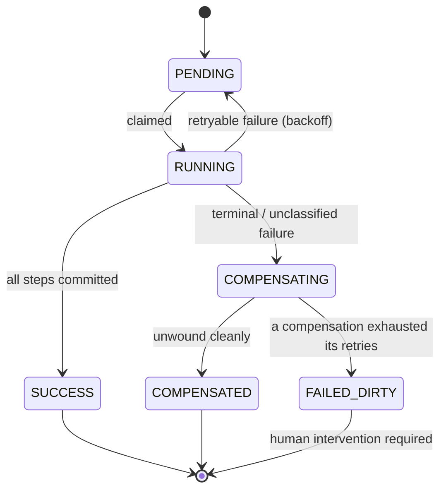

# Sankalp

A durable saga orchestrator for money movement. Kill any worker process at any
instant — mid-step, no chance to clean up — and workflows resume from their last
committed checkpoint with **no side effect executing twice**.

Built to survive the failure mode that breaks most "reliable" job systems: a process
that dies between doing the work and recording that it did.

> **Guarantee, stated precisely:** exactly-once *effects*, achieved through
> at-least-once *execution* plus idempotency — never "exactly-once delivery," which is
> impossible across a process boundary. Every guarantee in this repo is backed by a
> test that was observed to fail when its mechanism was removed.

---

## What it is

Sankalp runs multi-step financial workflows (sagas) as durable state machines in
Postgres. Each step is checkpointed; a failed saga is unwound in reverse with
compensating actions; and every state change that needs to reach the outside world is
published reliably through a transactional outbox.

It is deliberately **not** a general-purpose task queue. The design choices —
integer money, append-only ledger, fencing tokens, semantic compensation — are the
choices a payments system makes.

## Core guarantees

- **Crash recovery.** A `SIGKILL`'d worker's in-flight work is resumed by another
  worker once its lease expires. Completed steps replay as checkpoint lookups, not
  re-executions.
- **Exactly-once effects.** A step may *execute* more than once (a crash between the
  side effect and its checkpoint), but its *effect* lands once, because a committed
  `step_outputs` row is both the checkpoint and the idempotency guard.
- **No zombie writes.** Every ownership-scoped write carries a fencing token; a stalled
  worker that wakes up holding a stale token writes zero rows. This is the Redlock
  zombie-writer problem, closed.
- **Sagas unwind cleanly.** On terminal failure, completed steps are compensated in
  reverse order. Compensations are idempotent and crash-safe, checkpointed the same way
  forward steps are.
- **Reliable eventing.** A state change and its event are written in a single Postgres
  transaction — the dual-write problem solved — then drained to a stream at-least-once.

## Three ideas worth reading closely

These are the design decisions the whole system rests on.

### `SKIP LOCKED` is a throughput device, not a safety device

Workers claim runnable rows with `SELECT ... FOR UPDATE SKIP LOCKED`. It's tempting to
think this is what prevents two workers from grabbing the same saga. It isn't.

Under `READ COMMITTED`, even plain `FOR UPDATE` never double-claims: the loser of a race
blocks, re-evaluates the row's predicate after the winner commits, finds it no longer
matches, and moves on. Removing `SKIP LOCKED` is therefore a **performance** regression
(workers convoy behind one row), not a correctness bug. Safety rests on the
`step_outputs` primary key and the fencing token — not on the lock.

### Exactly-once *effects*, not exactly-once *delivery*

A worker can be killed after a step's side effect commits but before its checkpoint
does. On resume, that step runs again — at-least-once execution is unavoidable. What
makes the *effect* exactly-once is that completed steps carry a `step_outputs` row that
the resume replays as a lookup, and side-effecting steps are idempotent by construction.
Durability protects the checkpoints of *completed* steps; the killed step re-runs.

### Fencing tokens close the Redlock gap

A distributed lock (Redlock and friends) does not, by itself, stop a stalled lock-holder
from writing after its lease has been reassigned. Sankalp increments a `fencing_token` on
every claim and guards every ownership-scoped write with
`WHERE id = $1 AND owner_id = $2 AND fencing_token = $3`. A preempted worker's write
matches zero rows and is abandoned. The lock coordinates; the token enforces.

## Architecture

Work is **pulled, not pushed.** Workers claim runnable rows from Postgres; there is no
scheduler or load balancer routing work to them. Adding workers self-balances, with
backpressure for free (a worker only claims what its concurrency budget allows).

```
  ┌──────────┐   POST /workflows      ┌──────────────┐
  │ FastAPI  │ ─────────────────────▶ │  workflows   │ ◀── the queue + saga state
  │  ingest  │   (Idempotency-Key)    │  (Postgres)  │
  └──────────┘                        └──────┬───────┘
                                             │  claim: FOR UPDATE SKIP LOCKED
                                             ▼
                                    ┌───────────────────┐
                                    │     Worker(s)     │  capacity-bounded,
                                    │  ├─ executor      │  lease-renewed
                                    │  └─ drain (opt.)  │
                                    └─────────┬─────────┘
                                              │  outbox INSERT in the SAME
                                              │  transaction as the checkpoint
                                              ▼
  ┌──────────────┐   SKIP LOCKED drain    ┌───────────────┐
  │    outbox    │ ──── XADD ───────────▶ │ Redis Stream  │
  │  (Postgres)  │   then mark published  │  (transport)  │
  └──────────────┘                        └───────────────┘
```

Postgres is the source of truth. The Redis Stream is lossy transport — if it drops
events, the drain republishes from `outbox`.

### Tables

| Table            | Role |
|------------------|------|
| `workflows`      | Saga state machine: status, `owner_id` + `fencing_token`, `lease_expires_at`, `attempt`, `run_after`. |
| `step_outputs`   | Durable checkpoints **and** the idempotency guard, in one table. A step is done iff a row exists. PK includes `kind` (`FORWARD` \| `COMPENSATION`), so forward execution and compensation share one replay rule. |
| `outbox`         | Events written in the same transaction as the step checkpoint; partial index on `published_at IS NULL`. |
| `ledger_entries` | Append-only, double-entry money movement. A `BEFORE UPDATE OR DELETE` trigger raises on any mutation; a UNIQUE `(workflow_id, step_name, account_id, direction)` makes double-posting impossible. |

(`side_effects`, `step_attempts`, `crash_gates` exist only to instrument the crash
tests — they let a test kill a process at a chosen instant and then prove, from
committed rows, that a step ran twice but took effect once. They are not part of the
runtime.)

Migrations are forward-only (`001_core_schema.sql`, `002_crash_gate.sql`,
`003_saga.sql`), checksum-verified, applied to both the dev and test databases.

## Saga lifecycle

Six states. The interesting one is the last.



An **unclassified** failure is treated as terminal on purpose: an unrecognised error is
not evidence that re-running the step is safe, and compensation is idempotent by
contract, so the loud path (unwind) is safer than the quiet one (retry into a possible
double-charge).

`FAILED_DIRTY` is deliberate. When a compensation can't be made to succeed, the saga
stops at a clean boundary — everything above the failure unwound, everything below
untouched — and pages a human rather than guessing. Money is in a known-inconsistent
state; the engine has exhausted what it can safely do. Compensations run in reverse
`seq` order precisely because later steps depend on earlier ones, so unwinding out of
order can make the mess worse.

## How correctness is proven

Every safety claim has a test that was **watched failing without its mechanism**, then
restored (files verified byte-identical). A few examples:

- Remove the lease-expiry clause from the claim query → crash recovery times out.
- Skip a completed step's checkpoint → a killed-and-resumed saga double-executes it.
- Move the outbox INSERT out of the checkpoint transaction → a rolled-back step leaves
  an orphan event.
- Invert the drain's publish/mark order → the crash test's stream assertion fails,
  proving the test actually pins XADD-before-mark.

Three real-process crash gates run under repetition (each `SIGKILL`s an actual worker or
drain subprocess, not a cancelled task): forward recovery, compensation recovery, and
drain at-least-once.

## Phase 4 Gate

`docs/spec.md`'s Phase 4 Gate was rescoped to: a reproducible load-test results table with
hardware stated, committed limit-vs-RTT time series, overload behavior proven under both
criticality classes, an honest methodology section, and a chaos suite. The load-testing half is
closed; the chaos suite is one scenario built, one more cited to an existing test, and the rest
of `docs/spec.md`'s fault table deferred outright, below.

### Results, measured

One machine — an Intel Core 7 240H laptop (8 cores / 16 threads) — ran the load generator (k6),
the API, the workers, Postgres, and Redis simultaneously. Nothing here was measured across a
network.

| Rate (rps) | p99 | Note |
|---|---|---|
| 200 | 40.8ms | |
| 400 | 81.5ms | |
| 450 | 48.0ms | |
| 500 | 43.4ms | **capacity** |
| 550 | 1114ms | partial — n=8139, aborted at 15.9s on the `dropped_iterations` guard — **the corner** |

p99 is flat across 40–80ms through 500 rps — flat in aggregate, not a clean curve: 400 rps is the
worst point in the band at 81.5ms, above both 450 rps (48.0ms) and 500 rps (43.4ms). The 550 rps
row is a partial sample from a run that aborted before completing its step, not a finished
measurement — but at ~26× the 500 rps figure, it shows the corner plainly. By Little's Law, 500
rps at the flat band's ~7ms average latency implies ~3.5 requests in flight at capacity.

The adaptive concurrency limiter finds that number on its own, independently: at 750 rps (1.4×
capacity) with `min_limit` lowered to 2, it converges to a limit of 4 — 165 of 180 one-second
windows sat exactly there. At 2500 rps (5×) with the shipped default `min_limit=5`, it instead
pins at the floor — 176 of 180 windows at exactly 5. That's the floor setting the operating
point, not the gradient converging; the equilibrium it would otherwise find (4) sits one below
where the floor stops it.

With both limiters on as shipped, at 2500 rps: the Redis token-bucket rate limiter shed 113 of
roughly 450,000 requests — 0.025%, nearly inert. The concurrency limiter, pinned at its floor,
did essentially all of the shedding.

### Limit vs. RTT, as data

Committed under `loadtest/results/`: `adaptive-isolated-750-min2/` and
`adaptive-isolated-2500-min5/`, each holding `adaptive_timeseries.csv`, `rtt_timeseries.csv`, and
a rendered `timeseries.png`. The figure in each stacks the admission limit on top against RTT
p99, split by criticality, on the same time axis below — so the limit's descent and its effect
on tail latency read off the same plot.

### Overload behavior

`HIGH_FRACTION=0.2` — HIGH is a fifth of offered load throughout.

- **750 rps (1.4× capacity, `min_limit=2`):** HIGH 27,001 admitted, 0 shed. LOW 61,211 admitted,
  46,789 shed. Admitted p99: HIGH 32.4ms, LOW 17.1ms.
- **2500 rps (5× capacity, shipped `min_limit=5`):** HIGH admission ran 50.5%, 61.4%, and 61.5%
  across three identical runs — a range, not a single figure. LOW: 253 admitted against 359,748
  shed (0.07%) — effectively closed out. Admitted p99: HIGH 299.6ms, LOW 750.2ms.
- **Rejection is cheap; admission can be slow.** A shed LOW request returns in p50 0.70ms at 750
  rps and 1.17ms at 2500 rps — refusing work costs almost nothing. A shed HIGH request at 2500
  rps returns in p50 251.4ms, which is `high_criticality_wait_seconds` (0.25s, `adaptive.py`)
  expiring: LOW is refused with no wait at all, HIGH waits a bounded quarter-second for a permit
  and is only refused once none frees up in that window.
- **Two different questions.** At 5×, client-observed durations are dominated by that configured
  wait — but the limiter's own recorded RTT deliberately excludes admission time
  (`adaptive.py`'s `record_rtt` docstring: never fold in time spent queued waiting for
  admission). The admitted-p99 figures above and the shed-request return times above are not
  comparable to each other; they answer different questions.

### Methodology and its limits

Every number above was generated and measured on the same laptop — generator contention is
inside every figure here, not netted out. That laptop ran everything under WSL2 on Windows:
Postgres and Redis in Docker containers inside that VM, not on bare metal — a further qualifier
on the measured ceiling alongside the same-machine caveat. The measured ceiling is a property of
this setup, not a claim about the software's ceiling on real hardware. A separate control run
drove 2500 rps against `/openapi.json` (bypasses all rate-limiting/concurrency middleware) and
sustained it cleanly, confirming 2500 rps was achievable from this generator on this host before
trusting any number measured against it. Run-to-run variance at 5× was real: the limiter's
*behavior* was deterministic across repeats (floor-pinned, same descent shape every time), but
the *admission percentage* that behavior produced was not — see the three-run range above, not a
single number.

### Chaos suite

One scenario is built (DB latency), one more is cited to an existing test (worker killed
mid-step), and the rest of `docs/spec.md`'s fault table is deferred outright.

- **DB latency +500ms** — `tests/chaos/test_chaos_db_latency.py`, via Toxiproxy.
- **Worker killed mid-step** — cited to `tests/test_crash.py`, which aims the kill
  deterministically at a step already in flight and asserts `step_attempts == 2` against
  `side_effects == 1`: attempted twice, took effect once.

Both faults are checked against five shared invariants in `tests/chaos/invariants.py`. Two of
those five — reconciliation and outbox drain — were passing against **empty tables** until
commit `085327c` and the commits after it: no production workflow posted to `ledger_entries` or
called `ctx.emit` before then, so both checks ran against nothing and passed vacuously. The
DB-latency scenario now alternates `demo_crash` and `demo_transfer` submissions so all five
invariants have real data to check. Evidence from a green run: 300 `demo_crash` and 300
`demo_transfer` workflows in `SUCCESS`, 600 `ledger_entries` rows, 300 outbox rows all
published.

Deferred, not built — the rest of `docs/spec.md`'s chaos fault table: DB connection cut, Redis
down, network partition worker↔DB, gateway 500s/timeouts, and zombie worker (`SIGSTOP`/
`SIGCONT`). The zombie-worker case matters most of these: fencing-token rejection is a Phase 1
claim, and it has never been tested against a worker actually stalled mid-write, only against
the crash-recovery path.

## Running it

Requires Docker (Postgres 16 + Redis 7) and Python 3.14.

<!-- TODO(dhanush): confirm these against your Makefile — run `grep -E "^[a-z-]+:" Makefile` -->

```bash
# bring up Postgres + Redis
docker compose up -d

# apply migrations to both databases
make migrate

# run the full test suite
make test

# the crash gates (real SIGKILL, 20 repetitions each)
make test-crash

# run a worker (also drains the outbox by default)
make run-worker            # <!-- TODO: confirm target name -->

# or run the drain as its own process
make drain
```

Config is via `SANKALP_*` environment variables; see `.env.example`.

## Non-goals and known limits

This section is deliberately as prominent as the guarantees. Knowing where a system's
edges are is the point.

- **At-least-once delivery, not exactly-once.** The drain can publish an event twice (a
  crash between XADD and marking it published). Consumers **must** dedupe on the event's
  `id`. There is no exactly-once delivery here because there can't be.
- **Compensation is semantic, not a rollback.** Sagas don't roll back committed
  transactions across services; they run compensating actions (refund, release) that may
  themselves be observable. `FAILED_DIRTY` exists because some inconsistencies can only
  be resolved by a human.
- **Single-region, single-primary Postgres.** Coordination correctness relies on
  linearizable writes to one primary. This buys `SKIP LOCKED`, advisory locks, and
  fencing without a consensus layer — at the cost of a single-region ceiling.
- **Benchmarks are single-machine, not distributed.** See [Phase 4 Gate](#phase-4-gate) for
  measured numbers — capacity, overload behavior, and their caveats. What's still missing is a
  load generator on separate hardware from the system under test.
- **Ledger immutability is enforced at two layers.** A row-level trigger blocks
  `UPDATE`/`DELETE` on `ledger_entries`. It cannot see `TRUNCATE` — that's not a row
  operation, so it never fires a row trigger — so the second layer is the `sankalp_app`
  grant set (`migrations/004_restricted_role.sql`), which has `SELECT`/`INSERT` only and
  no `TRUNCATE` on the table. The test suite's own truncate fixture still connects as the
  owning `sankalp` role, which is deliberately unrestricted (see
  `tests/test_ledger.py::test_truncate_is_deliberately_not_blocked`).
- **The `sankalp_app` password in `004_restricted_role.sql` is a dev-only literal**,
  matching the `sankalp`/`sankalp` convention already in `docker-compose.yml`. Production
  would inject it via environment or a secret manager, not commit it in migration SQL.

## Roadmap

Phases 1 through 3 (above) are complete, tested, and the shippable core — resilience (Redis
token-bucket rate limiting, adaptive concurrency, the restricted `sankalp_app` database role)
included. Planned:

- **Observability (Phase 4):** OpenTelemetry tracing threaded through the outbox's
  `trace_context` column, and Prometheus metrics for queue depth, lease churn, and drain
  lag. The [Phase 4 Gate](#phase-4-gate)'s load-test results and first chaos scenario are
  done; tracing and dashboards are what's left.

## Build notes

`docs/build-log-day1.md`, `docs/build-log-phase1.md`, and `docs/build-log-phase2.md`
record the design decisions and the bugs found while building — including a real
concurrency bug the compensator exposed, where a worker could re-claim its own
in-progress unwind and run compensations concurrently (a double-refund with no crash
involved), fixed at the claim layer.
